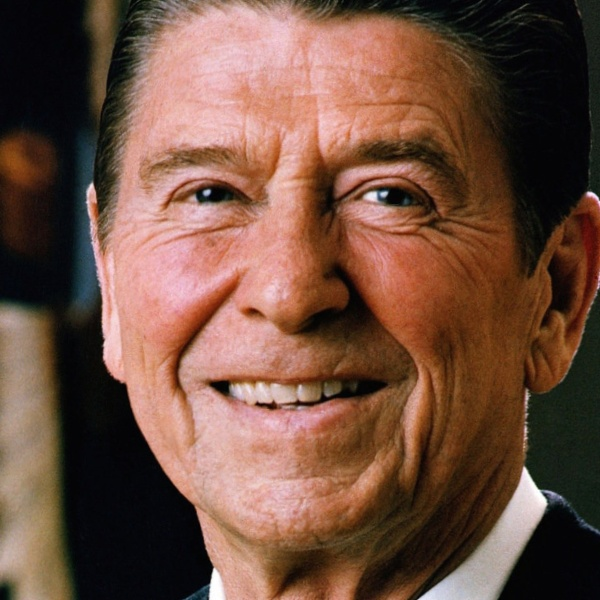

# 👤 Composite Face Synthesis using OpenCV and Python

## 📌 Project Overview

This project demonstrates how to synthesize a **composite human face** by blending facial features from multiple source images using **OpenCV** and **Python**. It's a creative approach to explore facial morphing, alignment, and transformation techniques in the field of image processing and computer vision.

## 🎯 Objectives

- Detect facial landmarks from input images
- Align and normalize facial features
- Blend multiple faces into a single composite image
- Visualize and save the output

## 🛠️ Tools & Libraries

- Python 3.x
- OpenCV
- Dlib (for facial landmark detection)
- NumPy
- imutils

## 🧠 How It Works

1. **Face Detection:** Load and detect faces using Dlib's pretrained HOG-based detector.
2. **Facial Landmark Detection:** Identify 68 facial landmark points.
3. **Alignment:** Align the faces based on the eyes and mouth.
4. **Feature Averaging:** Compute the average of each facial landmark across images.
5. **Triangulation and Warping:** Use Delaunay triangulation to morph face regions.
6. **Blending:** Seamlessly blend features into one synthesized composite face.

## 🖼️ Sample Output

<p align="center">
  
</p>

## 📁 Folder Structure

project/
│
├── presidents/ # Input images and its facial landmarks
├── composite_face.py # Main script
├── gui.py # alignment function
├── gui2.py# blending function
├── output_img #output image 
└── README.md # This file

## 🚀 Getting Started

1. **Clone the repository:**
   ```bash
   git clone https://github.com/mdmobeen2005/project.git
   cd project
## Run the script
python faceaverage.py


